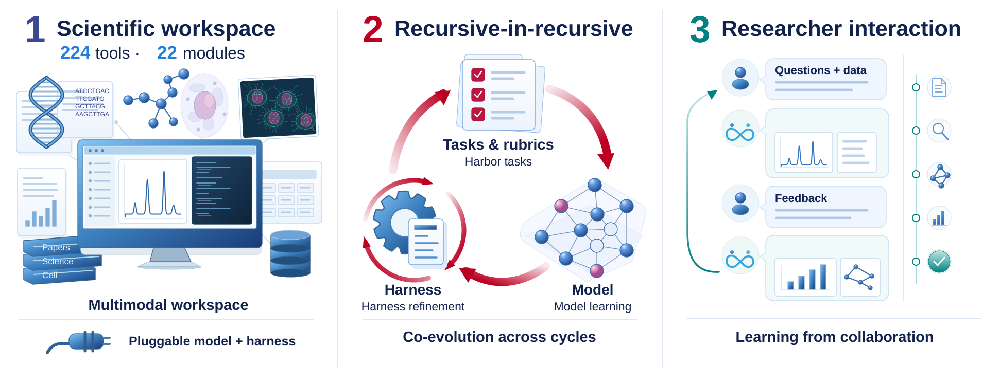
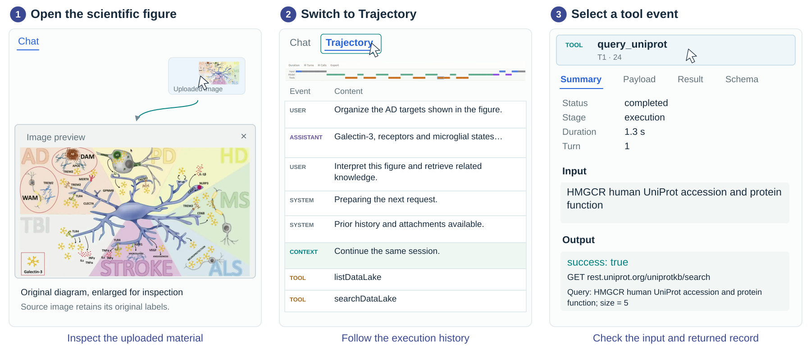
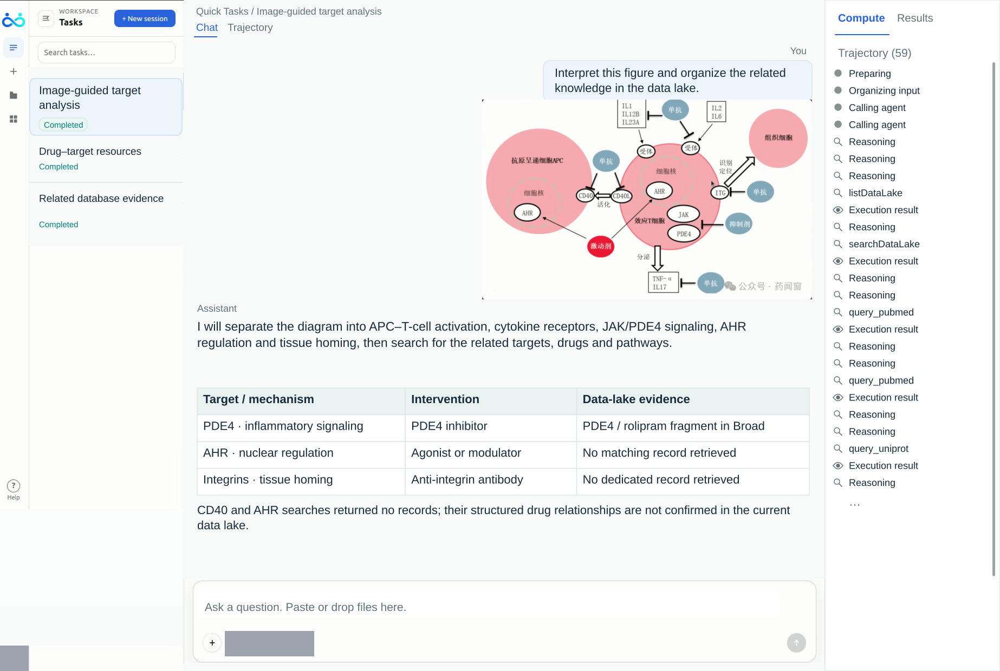
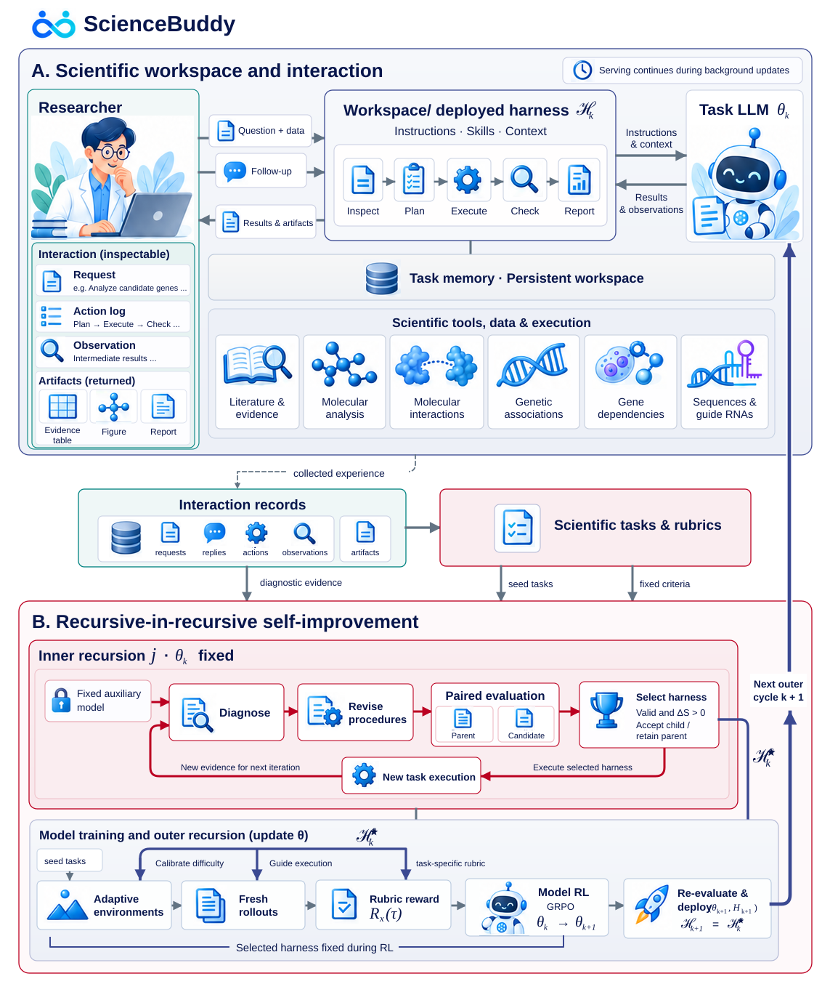

<div align="center">

<a href="http://science-buddy.io/" title="Open ScienceBuddy Preview">
  <picture>
    <source media="(prefers-color-scheme: dark)" srcset="assets/readme/wordmark-dark.svg">
    
  </picture>
</a>

### Your interactive scientific agent.

<p align="center">
   &nbsp;<a href="http://science-buddy.io/"></a>&nbsp; 
</p>

</div>

---

<p align="center">
  <a href="http://science-buddy.io/"></a>
  &nbsp;
  <a href="https://arxiv.org/abs/2609.17523" title="Paper on arXiv"></a>
  &nbsp;
  <a href="#examples"></a>
  &nbsp;
  <a href="#citation" title="Citation"></a>
</p>

<div align="center">

## ScienceBuddy: Recursive-in-Recursive Self-Improvement<br>for Interactive Scientific Agents

Explore your papers, data and scientific figures with an interactive agent that helps refine analyses and can improve its procedures and model through collaboration.

</div>

## 📰 News

- **2026-09-17 — ScienceIDE released.** Turning the world's scientific code into executable learning environments for scientific agents, with the PhAI-IDE-4B/9B/72B model series. [Paper](https://arxiv.org/abs/2609.19134) · [Code](https://github.com/aitofound/ScienceIDE) · [Models](https://huggingface.co/collections/AItonomy/scienceide-model-series)
- **2026-09-16 — ScienceBuddy released.** An interactive scientific workspace with recursive-in-recursive self-improvement for agent harnesses and models. [Try ScienceBuddy](http://science-buddy.io/) · [Paper](https://arxiv.org/abs/2609.17523) · [Research code](#rsi)

<p align="center">
  
</p>

<p align="center"><em>Scientific collaboration supplies experience for improving both working procedures and the task model.</em></p>

The **`science-buddy-preview`** release brings together two parts:

| | What you can explore |
| --- | --- |
| **1. ScienceBuddy for researchers** | The scientific workspace, access information, a recorded demonstration and example research workflows |
| **2. Double-recursive RSI research** | The open experiment code for improving a Python harness and task model through alternating learning stages |

<a id="sciencebuddy"></a>

## 🔬 1. ScienceBuddy: work with your scientific material

ScienceBuddy brings researcher dialogue, scientific tools, execution records and
analysis artifacts into a shared workspace. Its input and document workflows span
multiple scientific domains, while the current tools and data specialize in
biomedicine.

- **Start with questions and material.** Supply papers, tables, biological sequences
  or scientific images alongside a natural-language request.
- **Connect claims to evidence.** Ask the agent to inspect available data, retrieve
  literature and protein information, and organize findings and evidence gaps.
- **Refine the analysis in conversation.** Add another figure, narrow the scope or
  request a different comparison within the same task.
- **Inspect the work behind an answer.** Follow activity in Compute, explore the
  Trajectory, and examine tool inputs, outputs and generated artifacts.

The paper's workspace overview describes 224 tools across 22 functional modules,
covering areas including genomics, molecular and cancer biology, pharmacology,
bioimaging, literature retrieval and database queries.

<a id="access"></a>

### Use the workspace

Open [ScienceBuddy Preview](http://science-buddy.io/) in your browser to explore
the scientific workflows below. The public web version is `science-buddy-preview`.

1. **Create a task.** Start a new session or revisit a task in the sidebar.
2. **Add your material.** Type a question and attach or paste the relevant figures,
   documents or data. State the output you need: an evidence table, study plan,
   comparison or explanation.
3. **Inspect the response and execution.** Use Chat for the dialogue, Compute for
   activity, Results for artifacts and Trajectory for the event record.
4. **Follow up.** Ask for supporting records, clarify missing information or change
   the scientific focus while retaining the task context.

<details>
<summary><b>Inspect a figure, trajectory and tool result</b></summary>

<p align="center">
  
</p>

The paper illustrates how a researcher opens an uploaded diagram, switches to
Trajectory and selects an earlier UniProt lookup to examine its input and output.
English interface text is reconstructed from recorded interactions; uploaded
scientific diagrams retain their original labels.

</details>

<a id="examples"></a>

### 🎬 Demo: from scientific figures to follow-up questions

https://github.com/user-attachments/assets/6afb8e6a-fdbc-4167-9be2-f9221fe0a27a

Watch a researcher upload scientific figures, inspect generated analysis and live tool activity, and continue the conversation with follow-up questions.

[Try ScienceBuddy](http://science-buddy.io/) · [Download demo video](https://raw.githubusercontent.com/Gen-Verse/ScienceBuddy/main/assets/sciencebuddy-demo.mp4) · [Example from the paper](#example-from-the-paper)

### Example from the paper

The example below is translated and abridged from the recorded interaction in
the paper. It illustrates a workflow and reported observations, rather than a
benchmark score.

<details open>
<summary><b>Interpret a scientific figure and organize related evidence</b></summary>

**Researcher request**

> Interpret this figure and organize the related knowledge in the data lake.

An immune-signaling diagram directs the analysis toward targets, drugs and
pathways. The response organizes the findings into an evidence table and separates
retrieved records from missing evidence: the paper reports a PDE4/rolipram
fragment, while CD40 and AHR searches returned no matching records.

<p align="center">
  
</p>

*English UI and dialogue are reconstructed from the recording. The scientific
figure retains its original labels; account and model identifiers are masked.*

</details>

---

<a id="rsi"></a>

## 🔁 2. Double-recursive RSI: improve the harness and the model

Scientific collaboration can reveal reusable lessons about how to approach the
next task. ScienceBuddy's recursive-in-recursive self-improvement framework couples
two learning processes: revise the harness that guides the agent, then train the
model that acts through it. Each updated model participates in the next round of
harness improvement.

| Inner recursion · model fixed | Outer recursion · harness fixed |
| --- | --- |
| Collect task interactions and feedback | Generate fresh on-policy task attempts |
| Propose Python harness programs | Score submitted answers with a verifier |
| Compare candidates with their parent on fixed Val tasks | Update the task model with SkyRL GRPO |
| Pass the selected harness to model learning | Return the exported model to harness learning |

<p align="center">
  
</p>

*Original method figure from the ScienceBuddy paper. Panel B details the inner
harness recursion and outer model-learning recursion.*

### Experiment code in this repository

The paper figure includes adaptive task environments and online deployment.
The experiment configuration here uses a frozen task release and sequential
harness/RL stages.

The maintained experiment uses **Qwen3.5-4B**, a frozen **715 Train / 90 Val /
90 Test** release, and three harness/RL cycles. Each harness stage has three steps,
16 training interactions per step and three candidate proposals. Each RL stage
has 30 GRPO updates. The harness exposes `run(task, api)`; host code controls
execution budgets, grading and sampling.

These research experiments use bounded, verifier-assisted simulated feedback.
They are distinct from the researcher-facing workspace demonstration above.
Current configuration and stage measurements must be used when reporting this
experiment; the paper's earlier case-study plots are not substituted for it.

**Simple-SciBuddy** (`simple-scibuddy`, imported as `simple_scibuddy`) is the
simplified agent implementation used by these RSI experiments. Its source lives
in `src/simple_scibuddy/` and contains the experimental harness, execution broker,
verifier and SkyRL adapters. The full ScienceBuddy product source—including the
hosted workspace frontend, account system and product API service—is not included.

### Read the algorithm and reproduce the experiment

The detailed documentation follows the implemented learning procedure:

| Guide | Contents |
| --- | --- |
| [Double-recursive RSI algorithm](docs/algorithm.md) | Model/harness state, interaction feedback, candidate generation and selection, GRPO rewards and credit assignment, evaluation and stage handoff |
| [Experiment guide](docs/experiments.md) | Current configuration, task split, execution budgets, setup, launch, continuation and recorded outputs |

Start with the [algorithm guide](docs/algorithm.md#overview) to understand the two
recursions, then use the [setup and run instructions](docs/experiments.md#reproduce)
to reproduce the simplified experiment.

<a id="paper"></a>

## 📄 Paper

[ScienceBuddy: Recursive-in-Recursive Self-Improvement for Interactive Scientific Agents](https://arxiv.org/abs/2609.17523)

**arXiv:2609.17523** · [PDF](https://arxiv.org/pdf/2609.17523) · [PhAI Labs Technical Report](https://phai-labs.com/papers/sciencebuddy/)

PhAI Labs Technical Report **PHAI-TR-2026-02**, September 2026, v1.

<a id="citation"></a>

## 📖 Citation

```bibtex
@article{xue2026sciencebuddy,
  title={ScienceBuddy: Recursive-in-Recursive Self-Improvement for Interactive Scientific Agents},
  author={Xue, Shuhan and Zhong, Jianyuan and Nan, Ziyuan and Li, Wenbin and Yu, Zhaochen and Ding, Jinchao and Gao, Qiang and Zhan, Pengyu and Zhang, Yuntong and Cheng, Tian and Yin, Zhenfei and Wu, Yingcheng and Yang, Ling},
  journal={arXiv preprint arXiv:2609.17523},
  year={2026}
}
```

## 🤝 Acknowledgments

The experiment implementation extends [SkyRL](https://github.com/NovaSky-AI/SkyRL)
through this repository's own package and preserves a pinned, unmodified upstream
submodule. The workspace illustrations and usage examples are drawn from the
ScienceBuddy manuscript and its accompanying demonstration material.
